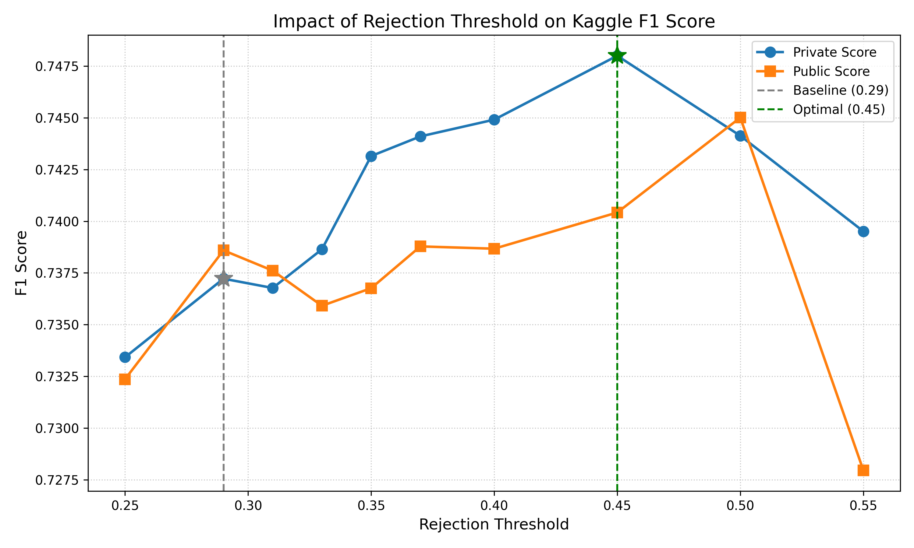

# forams-2026-private

## Competition Overview
The goal of this competition, hosted by the QIM Center (DTU Compute), is to detect and classify shells of planktonic foraminifera (forams) inside 3D volumetric micro-CT images.

The core challenge involves overcoming a major domain gap:
* **Training Data:** 2,425 labeled 3D volumes of individual, isolated forams across 14 classes.
* **Test Data:** 95 unlabeled 3D volumes of densely packed specimens (mixed with shell fragments and sediment).

## Evaluation
Submissions are evaluated using a custom metric (`Forams_metric.py`). The metric computes a 3D Euclidean distance matrix between ground-truth and predicted centerpoints, applies Hungarian bipartite matching without distance cutoffs, and scores the ratio of correct class assignments.

## Top 3 Solutions Summary

### 🥇 1st Place: "Synthesising the target domain, training like a taxonomist"
**By Caleb Powell & Beckett Sterner**
Solved the domain gap through heavy procedural data synthesis to build artificial packed volumes. Used decoupled networks for detection and classification, heavily integrating biological taxonomist domain knowledge (auxiliary classification heads for morphological characters), and 8-way flip TTA.
* [Write-up Link](https://www.kaggle.com/competitions/forams-2026/writeups/forams2026-1st-place-solution-write-up)

### 🥈 2nd Place: "Training on Synthetic Packed CT Volumes"
**By Octavi Grau**
Also relied on procedural scene packing. Trained a lightweight 3D U-Net to predict candidate centerpoints and used a ConvNeXt-Tiny classifier fed by 3 orthogonal 2D projection views. Incorporated a 15th background/debris class to reject false positives.
* [Write-up Link](https://www.kaggle.com/competitions/forams-2026/writeups/2nd-place-solution-for-the-forams2026-competition)

### 🥉 3rd Place Approach
**By Hanif Noer Rofiq**
Separated localization and classification. Fine-tuned a DINOv2-Base vision transformer on 2D slice crops. Constructed a 2.5D CenterNet-style detector using 5 adjacent slices per channel across 3 orthogonal axes, fusing predictions via a 48-voxel 3D Non-Maximum Suppression (NMS) pass to eliminate duplicate detections.
* [Write-up Link](https://www.kaggle.com/competitions/forams-2026/writeups/forams2026-3rd-place-approach)

---

## Our Approach: Optimizing the 2nd Place Solution

We initially attempted to build a hybrid pipeline combining the 3rd place's DINOv2 architecture with the 2nd place's data engine, but faced fundamental incompatibilities with spatial resolutions and fine-tuning.

Instead, we pivoted to maximizing the performance of the 2nd place solution (which natively scored 0.73722 Private).

### Hyperparameter Tuning
We analyzed the 2nd place ensemble configuration (`final_zk.yaml`) and discovered that its default prediction `rejection_threshold` of `0.29` admitted too many false positive detections. We performed a systematic hyperparameter sweep over the threshold, submitting the resulting predictions directly to the Kaggle Leaderboard to pinpoint the true optimal threshold.

By increasing the rejection threshold to `0.45`, we pushed the model's F1 score from **0.73722** to a massive **0.74800** on the Private Leaderboard, bridging a significant portion of the gap to the 1st place score!

### Why we couldn't replicate the 1st Place Solution
The 1st place solution (Caleb Powell & Beckett Sterner) utilized a vastly different architecture that scored 0.76438 (Private). They manually scraped morphological descriptions from an external biology website (`Mikrotax.org`) for every species and trained their model to explicitly answer these biological queries (e.g., "is the shell porous?"). This auxiliary supervision resolved conflation between visually similar classes. We could not replicate this without access to their proprietary scraped taxonomic dataset.

For a detailed analysis, see our [Hyperparameter Tuning Report](reports/hyperparameter_tuning_report.md).

### Citations and References
- **Competition Page**: [Forams 2026 - Kaggle](https://www.kaggle.com/competitions/forams-2026)
- **2nd Place Repository**: [octavigrau/kaggle-forams2026](https://github.com/octavigrau/kaggle-forams2026) (Cloned in `references/2nd-place`)
- **3rd Place Notebook**: [forams-dinov2-b-controlled-2xt4](https://www.kaggle.com/code/hanifnoerrofiq/forams-dinov2-b-controlled-2xt4) (Pulled in `references/3rd-place`)
